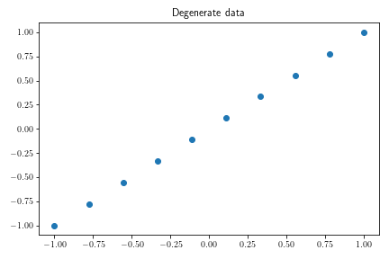
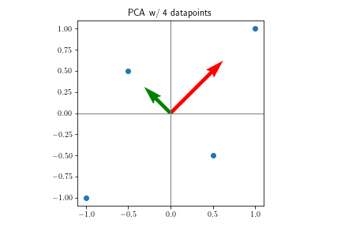
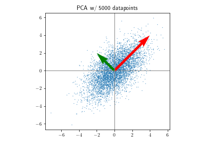
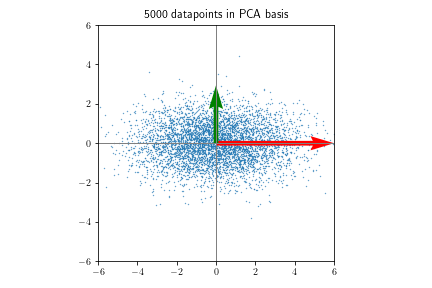
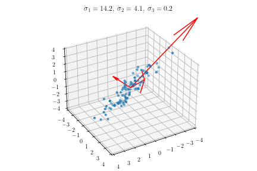
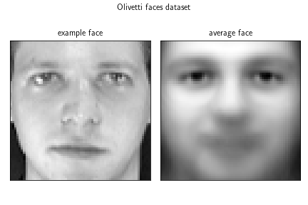
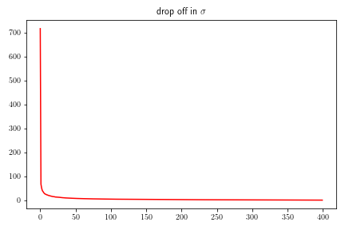
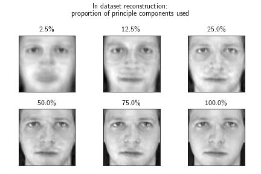
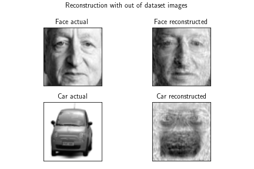
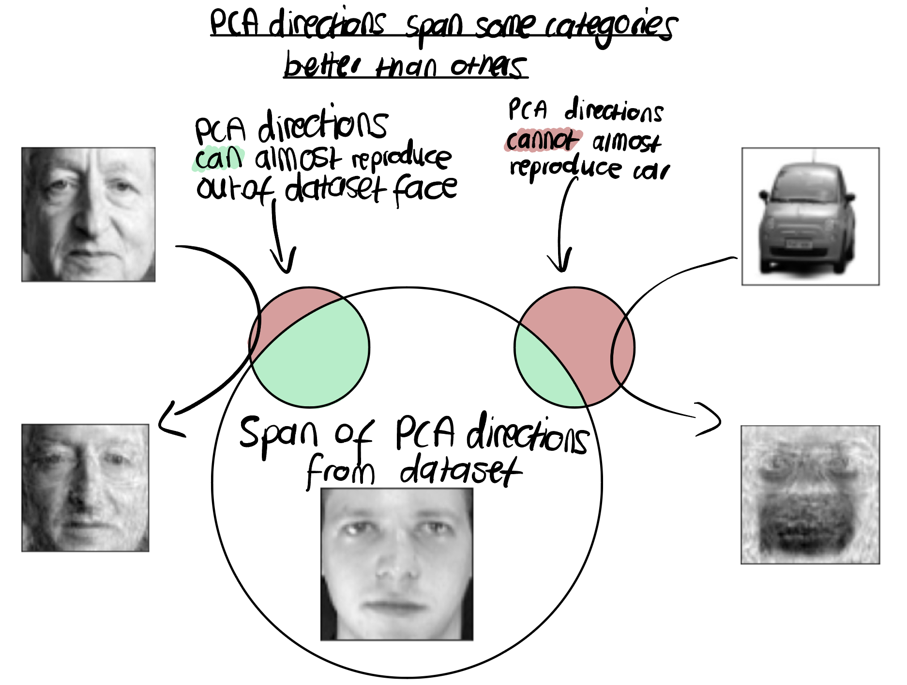

## What is PCA

Often times we want to reduce the dimensions of a problem for efficient processing. ‘*Algorithms for [reducing dimensionare] are based on the idea that the dimensionality of many data sets is only artificially high; though each data point consists of perhaps thousands of features, it may be described as a function of only a few underlying parameters’[1].* These methods are also useful for creating meaningful  two- and three- dimension visual respresentations. Principal Component Analysis (PCA) is the simplest of these methods in dimensionality reduction.

For example, imagine you have a data set that consisting of height, weight and some score on political beliefs, with each datapoint/person giving a point in 3d space. It is obvious that height and weight will be strongly correlated but you’d expect political beliefs not be correlated at all. Therefore, although our data has three dimensions, there are only really two degrees of freedom, the height/weight and political beliefs. PCA systematically finds these orthogonal correlations in much higher dimensions and quantifies how strong they are, thus allowing us to include the n most important correlations. 

Once in the lower dimensional space machine learning techniques can be used as normal such as clustering, neural networks etc. The value of the principle components denotes how important/much information is given by one of the orthogonal directions in this new basis. Therefore, we reduce dimensions by discarding directions with small principle components/importantance.

## Representing data

Putting data into a matrix, $\mathbf A$, with each row represents a datapoint and each column representing a parameters $x$ and $y$ e.g. height and weight. 

$$
\text{data}^T \text{data} = \mathbf A ^ T \mathbf A  = \left\lbrack \matrix{x_1 & x_2 & x_3 \cr y_1 & y_2 & y_3} \right\rbrack \left\lbrack \matrix{ x_1 & y_1 \cr x_2 & y_2 \cr x_3 & y_3} \right\rbrack = \left\lbrack \matrix{\sum_i x_i^2 & \sum_i x_iy_i \cr \sum_i y_ix_i & \sum_i y_i^2} \right\rbrack
$$

 

Equation ** shows what we get from $\mathbf A ^T \mathbf A$, on the diagonal entries we see the variance of the different parameters, the off diagonal gives the covariance between different parameters. This is the definitional form of the covariance matrix.

We now use the Singular Value Decomposition (SVD) to see if there are algebraicly simple ways to understand the covariance matrix. The SVD is the generalisation for eigendecomposition for non-square matrices i.e. # parameters =/= # datapoints. 

$$
\mathbf A = \mathbf U \mathbf \Sigma \mathbf V ^T
$$

Now if we form the covariance matrix $(\mathbf A ^T \mathbf A )$ , noting that $\mathbf U$  and $\mathbf V$ are unitary such that $\mathbf V \mathbf V^T = \mathbf U \mathbf U^T = \mathbf I$  . Since $\mathbf \Sigma ^ T \mathbf \Sigma$  is a diagonalised square matrix, we see this is the eigendecomposition for the covariance matrix. The eigenvectors (i.e. the columns of $\mathbf V$ ) give the orthogonal directions of variance with the respective eigenvalues giving the size of this variance. 

$$
\mathbf A ^ T \mathbf A = (\mathbf U \mathbf \Sigma \mathbf V ^T)^T(\mathbf U \mathbf \Sigma \mathbf V ^T) = \mathbf V \mathbf \Sigma ^T \mathbf U^T \mathbf U \mathbf \Sigma \mathbf V ^T = \mathbf V \mathbf \Sigma ^T \mathbf \Sigma \mathbf V ^T
$$

It is also possible to see that the eigenvalues (entries into sigmaT sigma) are the singular values, or principal components as we shall now call them squared. This is important as the square root of the variance is the standard deviation so we expect the principal components to correpsond to the standard deviation (and not the variances), though as V is part of the SVD we also expect these eigenvectors to hold. 

$$
\mathbf \Sigma ^T \mathbf \Sigma   = \left\lbrack \matrix{ \sigma_1  & 0 & 0 \cr 0 & \sigma_2 & 0 } \right\rbrack \left\lbrack \matrix{ \sigma_1 & 0 \cr 0 & \sigma_2 \cr 0 & 0 } \right\rbrack = \left\lbrack \matrix{ \sigma_1^2 & 0 \cr 0 & \sigma_2^2 } \right\rbrack
$$

So we see that it is possible to calculate all the important quantities of the covariance matrix ($\mathbf V \;\text{and} \; \mathbf \Sigma$) directly from the SVD which is far more computationally efficient than calculating $\mathbf A ^ T \mathbf A$  and then calculating its eigendecomposition. Therefore we can just used this. Now lets look at some data… 

## PCA in 2d

In two dimensions, if all the points lie on a line, there is a set relationship between the x and y variables, meaning one of them is redundant. In the case below where y = x, we can reduce to a single dimension by projecting the points into the principle component frame y=x and discard the second orthogonal direction as the singular value is zero in the orthogonal y=-x direction.

Let us consider a very simple example with four datapoints in 2d. This is represented by the$4 \times 2$  matrix below.

$$
\text{data} = \mathbf A = \left\lbrack \matrix{ 1 & 1 \cr -1 & -1 \cr 0.5 & -0.5 \cr -0.5 & 0.5 } \right\rbrack
$$

$$
\mathbf V = \frac{1}{\sqrt 2 }\left\lbrack \matrix{ 1 & 1 \cr 1 & -1  } \right\rbrack \mathbf \Sigma  = \left\lbrack \matrix{ 1 &  0\cr 0 & 2 \cr 0 & 0 \cr 0 & 0  } \right\rbrack
$$

Computing the SVD we find and plot the eigenvectors (columns of V) of the covariance matrix scaled by the standard deviation (singular values) in that direction. This plot shows that eigenvectors are in the two orthogonal direction of variance $x + y \; \text{and} \; x - y$ . Also, the singular value in the $x + y$  direction is twice the size of the singular value in the $x - y$  direction, affirming that this is just the standard deviation. Now increasing to 5000 datapoints (using a distribution with the same covariance) we see the exact same results. Nice! It is useful to rotate the data and now describe it in the eigenbasis of the covariance matrix also known as basis of the principal components. 

## PCA in 3d

Looking at some data in three dimensions and plotting the scaled principle component directions, we see that there is one direction that doesn't carry nearly as much information as the other two. In this case you just project the datapoints onto the principle component directions of the larger two singular values only.

 

## Eigenfaces

The eigenface dataset has 400 images that are taken from 40 people and is a great way to visualise PCA in higher dimensions. Each image is grayscale 64 x 64, so can be flattened into a 4096 dimension vector with values ranging from 0 to 1 for each pixel, below is an example image. As done previously, the principle components and their directions can be found from the SVD of the data matrix.

Constructing a $400 \times 4096$  data matrix and finding the important quantities through the SVD. The eigenvectors of the covariance matrix can be turned back into images, called eigenfaces. The images that correspond to th six largest covariance eigenvectors / principal components can be seen below. 

The graph below shows how quickly the singular values of the different eigenfaces falls off. As discussed earlier, principle components with small values offer little information, so we can discard some. If we go transform into the eigenface basis and then only take the k eigenfaces corresponding to the highe pricipal components and then transform back to images. Below is how the face is reproduced with different number of principle components used (i.e. variable k). For example, if we use just 100 principle components we compress the image ~41 times whilst still having a recognisable face. (not counting the face that we have the store the principle components and their directions).

## Reconstruction out of the dataset

Having messed around with the eigenbasis, I was interested into how this basis would reproduce images outside of the dataset.

The dataset has 400 images which is much less than the 4096 dimensions existing for an image. The PCA basis can span, at most, as many dimensions as there are data examples and this is only if the datapoints are linear independent, which wouldn’t expect to be true when all datapoints are images of faces. Therefore, the basis will not span the space of all images, but it is interesting to show how the PCA basis spans some areas better than others.

Below are two examples of how well out principle components reproduce it. Although neither are perfect, though the out of dataset face is reproduced much more faithfully than the image of the car. The sketch below shows how the space spanned by the principle components has much more over lap with the out of dataset face than the car, perhaps as you may expect. I’m not too sure I have much insightful to say about this but I thought it was a cool inuitive result.

[1] Algorithms for Manifold Learning, Lawrence Clayton, 2005

